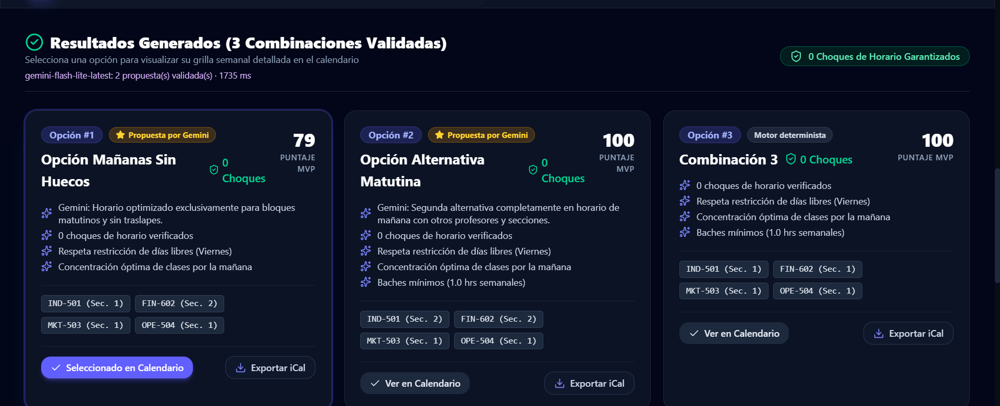

# Registros de Evidencia de Construcción (Las 4 Verticales)

Este documento centraliza la evidencia de funcionamiento y artefactos construidos para las 4 verticales evaluadas en el Proyecto Final (Track B).

---

## 1. Vertical BACKEND · Automatización
* **Capa 1 (Obligatoria)**: Motor de optimización end-to-end (`src/lib/optimizer.ts` en TypeScript y `src/backend/optimizer_demo.py` en Python) con gatillo desde interfaz web, validación de reglas de negocio, manejo de excepciones y reintentos.
* **Capa 2 (Bonus - Código Propio)**: Algoritmo determinista anti-traslapes e integración con Supabase + Gemini LLM guiado mediante especificaciones detalladas con el copiloto AI (Antigravity).

---

## 2. Vertical BACKEND · IA
* **Capa 1 (Obligatoria)**: Llamada real a Gemini desde la función serverless [`api/optimize.ts`](../api/optimize.ts) con el prompt versionado [`src/prompts/optimizer_prompt.txt`](../src/prompts/optimizer_prompt.txt) (v1.1) y salida JSON estricta. Modelo principal `gemini-flash-lite-latest`, respaldo `gemini-3.5-flash`. El resultado se valida, se muestra en la grilla y se registra en el log.
* **Capa 2 (Bonus - Guardrails)**: `validarPropuestasLLM` en [`src/lib/optimizer.ts`](../src/lib/optimizer.ts) reconstruye cada propuesta desde el catálogo real y descarta secciones inventadas, ramos faltantes o extra, traslapes, días prohibidos y profesores excluidos. Si Gemini falla, el motor determinista entrega los resultados. *(Pendiente para Capa 2 completa según rúbrica: agente con herramientas + set de evals documentado.)*

### Evidencia en producción (1 de octubre de 2026)
Optimización real en [proyecto-automatizaci-n.vercel.app](https://proyecto-automatizaci-n.vercel.app): Gemini (`gemini-flash-lite-latest`, 1.735 ms) propuso 2 horarios que pasaron el guardrail (badge "Propuesta por Gemini"), y el motor determinista completó la tercera opción.

**Ejemplo del guardrail en acción** (prueba local con restricciones *sin lunes ni viernes*, 3 ramos): existía una sola combinación válida; Gemini propuso un horario que violaba las restricciones, el guardrail lo rechazó y el motor determinista entregó la combinación correcta. El usuario nunca ve un horario inválido.

---

## 3. Vertical BACKEND · Base de Datos
* **Capa 1 (Obligatoria)**: Persistencia de logs de optimización y registros de consultas en Supabase Postgres (`optimizaciones_log`).
* **Capa 2 (Bonus - Supabase + RLS)**: Esquema DDL relacional completo (`src/db/schema.sql`) para tablas `cursos`, `secciones`, `bloques_horario`, `optimizaciones_log` con políticas de Row Level Security (RLS) habilitadas y cliente en `src/lib/supabase.ts`.

---

## 4. Vertical FRONTEND · Touchpoint / Interfaz
* **Capa 1 (Obligatoria)**: Touchpoint claro documentado en el README (§6) indicando gatillo, canal (SaaS Web Vercel) y entrega (calendario semanal interactivo + exportación).
* **Capa 2 (Bonus - UI Web Publicada en Vercel)**: Aplicación web React 18 + Vite + Tailwind CSS v4 con selector interactivo de cursos del MBAn UAI, panel de filtros y restricciones, grilla de horarios semanales, exportación a Google Calendar / iCal (`.ics`), modal de inspección SQL y diseño responsivo premium (`src/App.tsx`, `src/components/`).
