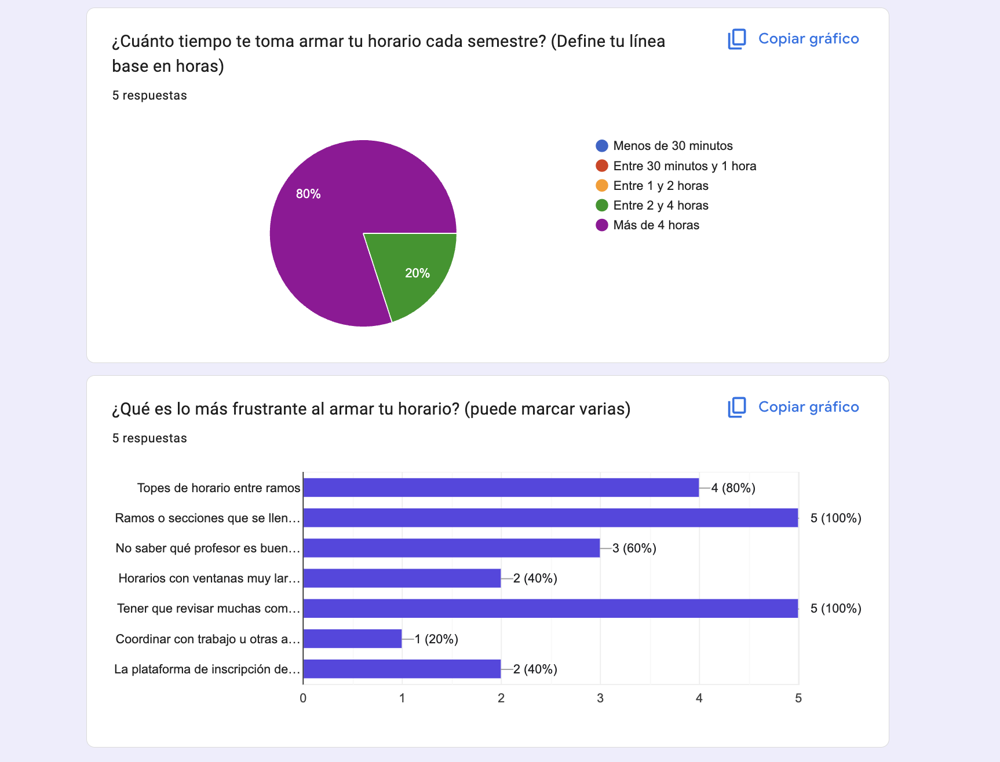
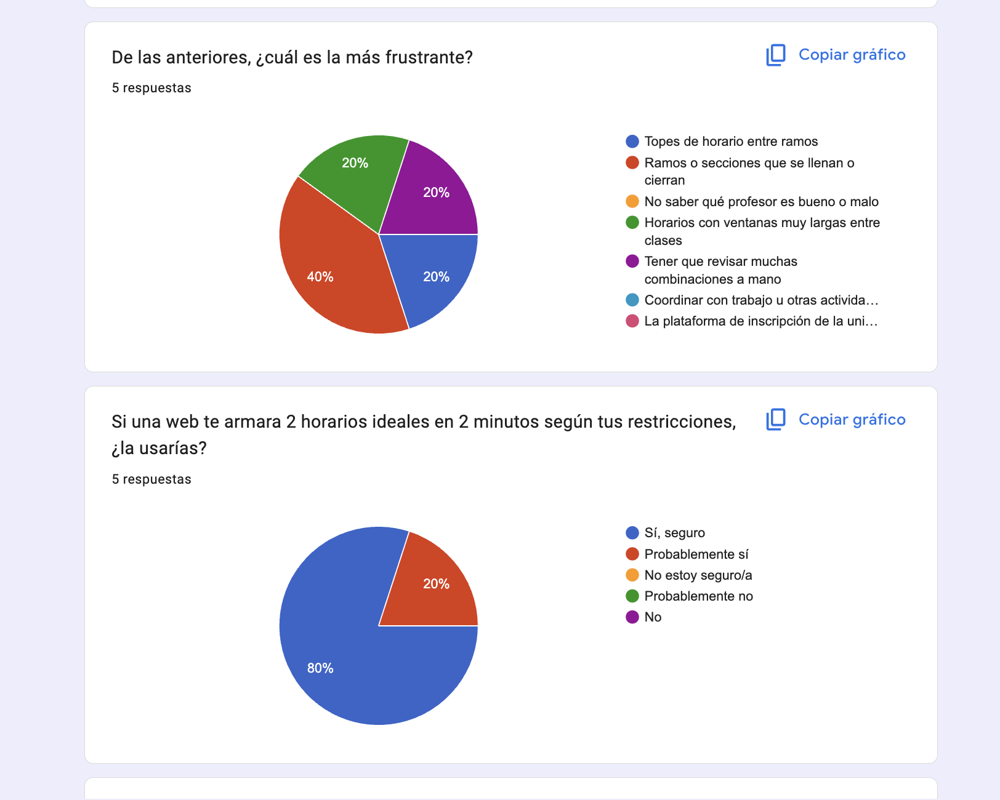
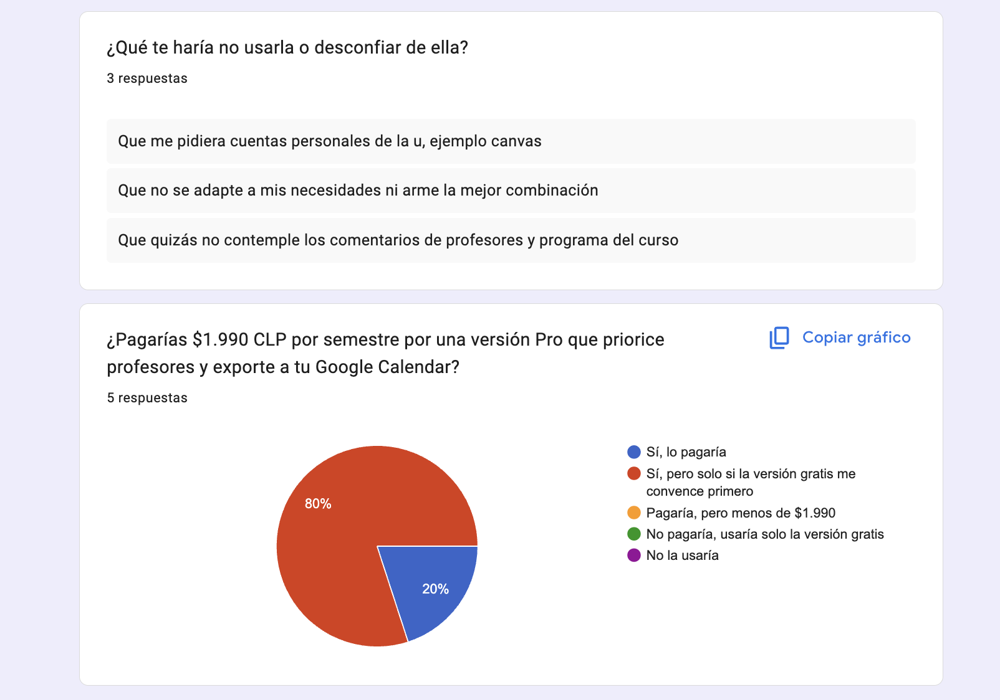

# Evidencia de Demanda · Encuesta en Google Forms

**Estado**: Encuesta cerrada y tabulada.  
**Canal**: Formularios de Google (Google Forms), distribuida a estudiantes universitarios.  
**Tamaño de muestra**: **N = 5 respuestas** (pregunta abierta 5: 3 respuestas).  
**Objetivo**: Levantamiento de datos sobre la línea base del dolor, barreras de adopción y disposición a pagar.

> ⚠️ **Limitación metodológica**: con N=5 la muestra es exploratoria y no estadísticamente representativa. Los resultados se usan como señal direccional de validación del problema, no como estimación de mercado.

Capturas originales de la consola de Google Forms en [`capturas_encuesta/`](capturas_encuesta/).

---

## 📊 Resultados por Pregunta

### 1. ¿Cuánto tiempo te toma armar tu horario cada semestre?

| Respuesta | N | % |
| :--- | :---: | :---: |
| Menos de 30 minutos | 0 | 0% |
| Entre 30 minutos y 1 hora | 0 | 0% |
| Entre 1 y 2 horas | 0 | 0% |
| Entre 2 y 4 horas | 1 | 20% |
| **Más de 4 horas** | **4** | **80%** |

**Lectura**: 100% de los encuestados dedica más de 2 horas, y 80% más de 4 horas. Confirma la línea base del dolor (V del filtro VRR).

### 2. ¿Qué es lo más frustrante al armar tu horario? *(selección múltiple)*

| Frustración | N | % |
| :--- | :---: | :---: |
| Ramos o secciones que se llenan o cierran | 5 | 100% |
| Tener que revisar muchas combinaciones a mano | 5 | 100% |
| Topes de horario entre ramos | 4 | 80% |
| No saber qué profesor es bueno o malo | 3 | 60% |
| Horarios con ventanas muy largas entre clases | 2 | 40% |
| La plataforma de inscripción de la universidad | 2 | 40% |
| Coordinar con trabajo u otras actividades | 1 | 20% |

### 3. De las anteriores, ¿cuál es la más frustrante?

| Respuesta | N | % |
| :--- | :---: | :---: |
| **Ramos o secciones que se llenan o cierran** | **2** | **40%** |
| Topes de horario entre ramos | 1 | 20% |
| Horarios con ventanas muy largas entre clases | 1 | 20% |
| Tener que revisar muchas combinaciones a mano | 1 | 20% |

### 4. Si una web te armara 2 horarios ideales en 2 minutos según tus restricciones, ¿la usarías?

| Respuesta | N | % |
| :--- | :---: | :---: |
| **Sí, seguro** | **4** | **80%** |
| Probablemente sí | 1 | 20% |
| No estoy seguro/a | 0 | 0% |
| Probablemente no | 0 | 0% |
| No | 0 | 0% |

**Lectura**: 100% de intención de uso positiva (80% "sí, seguro").

### 5. ¿Qué te haría no usarla o desconfiar de ella? *(abierta, 3 respuestas)*

1. "Que me pidiera cuentas personales de la u, ejemplo canvas"
2. "Que no se adapte a mis necesidades ni arme la mejor combinación"
3. "Que quizás no contemple los comentarios de profesores y programa del curso"

### 6. ¿Pagarías $1.990 CLP por semestre por una versión Pro que priorice profesores y exporte a tu Google Calendar?

| Respuesta | N | % |
| :--- | :---: | :---: |
| Sí, lo pagaría | 1 | 20% |
| **Sí, pero solo si la versión gratis me convence primero** | **4** | **80%** |
| Pagaría, pero menos de $1.990 | 0 | 0% |
| No pagaría, usaría solo la versión gratis | 0 | 0% |
| No la usaría | 0 | 0% |

---

## 🧭 Conclusiones e Implicancias para el Producto

| Hallazgo | Implicancia en OptiRamos |
| :--- | :--- |
| 80% dedica **más de 4 horas** por semestre a armar su horario. | Valida el dolor. La promesa "de horas a < 2 minutos" es el mensaje central. |
| "Revisar muchas combinaciones a mano" (100%) y "topes" (80%) son dolores casi universales. | Es exactamente lo que automatiza el motor: genera combinaciones y garantiza 0 traslapes. |
| El dolor #1 es que **las secciones se llenan** (100% lo marca, 40% lo elige como el peor). | El MVP no controla los cupos, pero entregar **2 alternativas** sirve de plan B inmediato. Roadmap: mostrar cupos disponibles y alertas de cierre. |
| 60% no sabe qué profesor es bueno, y una respuesta abierta pide considerar comentarios de profesores. | Refuerza la feature Pro de **priorización/exclusión de profesores**. Roadmap: integrar evaluaciones docentes. |
| Desconfianza ante **pedir credenciales de la universidad** (Canvas). | Decisión de diseño: OptiRamos **no pide login institucional**; trabaja con la oferta académica pública. |
| 100% pagaría, pero **80% solo si la versión gratis convence primero**. | Valida el modelo **Freemium**: el plan gratuito es el canal de conversión al Pro de $1.990 CLP. |

### Resumen de Variables Consolidadas
- **Total de Respuestas Recabadas**: 5
- **Tiempo de Planificación**: 80% más de 4 horas; 20% entre 2 y 4 horas.
- **Principal Frustración Identificada**: secciones que se llenan o cierran (40% como la principal; 100% la menciona).
- **Disposición de Adopción (P4)**: 100% positiva (80% "Sí, seguro").
- **Principales Factores de Desconfianza (P5)**: pedir credenciales institucionales, que no arme la mejor combinación, que no considere información de profesores/programa.
- **Disposición a Pagar $1.990 CLP (P6)**: 20% pagaría directamente; 80% condicionado a probar la versión gratis.
